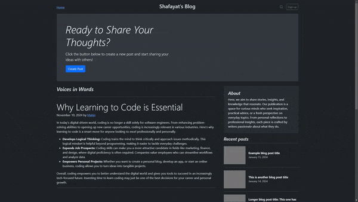

# Blog Website Project

A responsive and feature-rich blog website created with Node.js, Express, EJS, and Bootstrap. Users can create, edit, and delete blog posts, providing an engaging and interactive experience.

## Table of Contents

- [Project Overview](#project-overview)
- [Features](#features)
- [Technologies Used](#technologies-used)
- [Setup and Installation](#setup-and-installation)
- [Usage](#usage)
- [Future Improvements](#future-improvements)

## Project Overview

This project is a simple yet functional blog website where users can create and view blog posts. Each post includes a title, content, and date. This version does not store data persistently; posts are managed within the session.



## Features

- **Create Blog Posts**: Easily create and submit blog posts.
- **View Posts**: All posts are displayed in a modern, responsive layout.
- **Edit & Delete**: Users can edit or delete individual posts.
- **Responsive Design**: Adapts seamlessly to different screen sizes.

## Technologies Used

- **Backend**: Node.js, Express.js
- **Frontend**: EJS templating, Bootstrap for styling
- **Middleware**: Method Override for handling PUT/DELETE requests

## Setup and Installation

1. **Clone the Repository**:
   ```bash
   git clone https://github.com/shafayat666/web-node-blog-website.git
   cd blog-website
   ```
2. Install Dependencies:
    ```bash
    npm install
    ```
3. Start the Server:
    ```bash
    node index.js
    ```
4. **Access the Website**: Open your browser and go to http://localhost:3000.

## Usage

- Go to the homepage to view all posts.
- Click **Create Post** to add a new blog entry.
- Use the **Edit** and **Delete** buttons below each post to manage your entries.

## Future Improvements

- **Persistent Storage**: Integrate a database like MongoDB or MySQL.

- **User Authentication**: Allow users to log in and manage their posts.

- **Comments Section**: Enable comments on each post for interaction.


